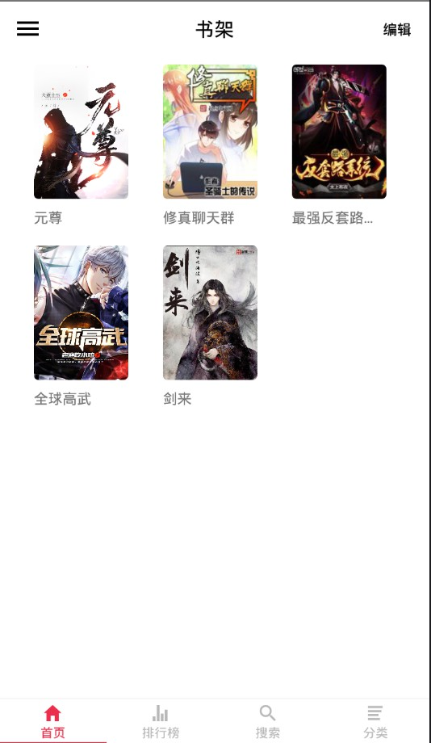
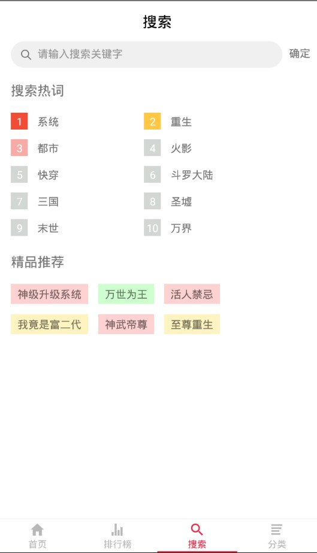
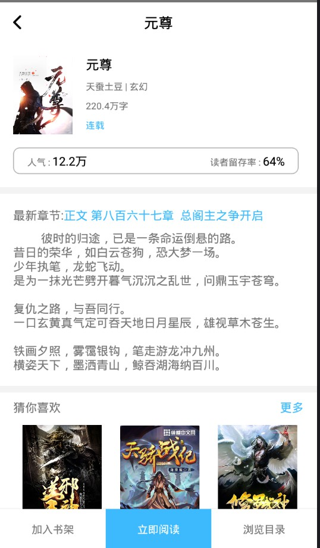
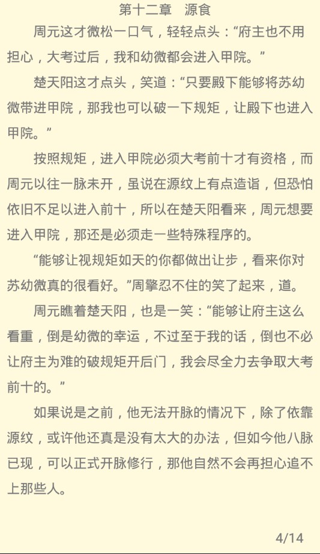

#### 金桥小说
基于React-Native制作的小说软件，目前只适配安卓。
技术栈：React-Native+Redux
接口使用的是追书神器的接口。
目前是测试版本，阅读器部分不太完善。

###截图
* 首页

* 搜索

* 分类

* 详情

* 阅读

## 运行
1. run `npm i`.
2. run `run react-native run-android`.

